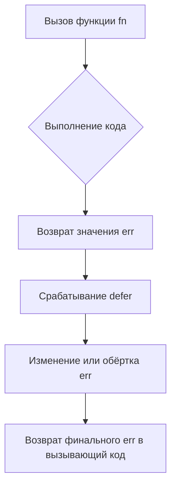

В Go секрет заключается в том, что если функция возвращает именованный параметр `err`, то в `defer` можно замкнуть его на анонимной функции и переприсвоить перед возвратом. Поскольку `defer` выполняется уже после вычисления возвращаемых значений, но до выхода из функции, запись внутри `defer` влияет на итоговое значение возвращаемого `err`.  

Таким образом, можно безопасно модифицировать ошибку в конце выполнения функции и это гарантированно «поднимется» в вызывающий код. Это часто используют для обёртывания или подмены ошибок.  

Пример:  

```go
func fn() (err error) {
    defer func() {
        if err != nil {
            err = fmt.Errorf("wrapped: %w", err)
        }
    }()
    return errors.New("original error")
}
```  

Диаграмма:  



```old
// как передать err из defer в вызывающую функцию выше? через именованный параметр результата: `func fn() (err error) { defer func() { err = errors.New("error!") }() return }`
```