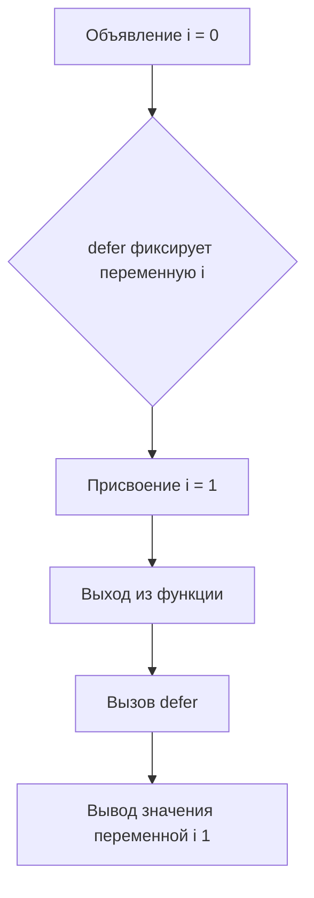

Секрет в том, что отложенные функции в Go захватывают переменные, а не их значения на момент объявления. В примере `defer func() { println(i) }()` захватывается сама переменная `i`. Когда срабатывает `defer` при выходе из функции, значение переменной уже изменено на `1`, поэтому и вывод будет именно `1`, а не `0`. Если бы нужно было зафиксировать текущее значение, то его пришлось бы передать как параметр в анонимную функцию.  

Диаграмма порядка событий:  


```old
// var i int; defer func() { println(i) }(); i = 1 - выведет 1
```