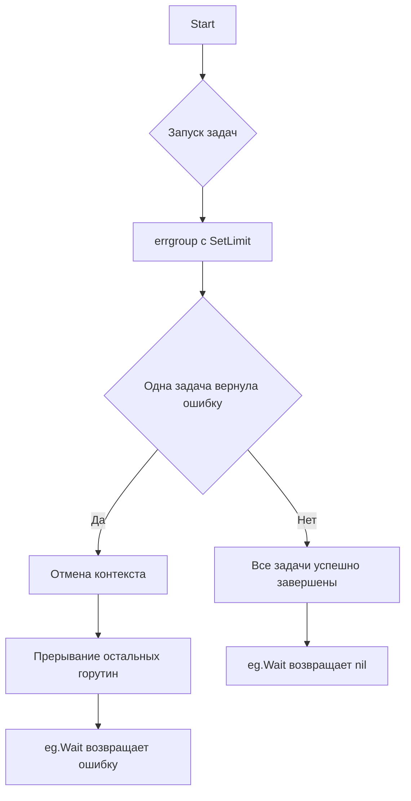

`errgroup` из `golang.org/x/sync/errgroup` — это примитив для запуска набора горутин с контролем ошибок: если хоть одна горутина вернет ошибку, все остальные будут остановлены. Метод `SetLimit` позволяет ограничить количество одновременно работающих горутин, что полезно при обращении к внешним ресурсам или ограниченных по числу соединений API. Таким образом достигается как контроль конкуренции, так и централизованная обработка ошибок.  

Пример:  

```go
eg, ctx := errgroup.WithContext(context.Background())
eg.SetLimit(limit)

for _, task := range tasks {
    t := task
    eg.Go(func() error {
        return doWork(ctx, t)
    })
}

if err := eg.Wait(); err != nil {
    log.Fatal(err)
}
```

Диаграмма:  



Ссылка: [golang.org/x/sync/errgroup](https://pkg.go.dev/golang.org/x/sync/errgroup) — документация пакета, где подробно описаны методики работы с группами горутин и совместной обработкой ошибок.

```old
// er := errgroup.Group{}; eg.SetLimit(limit) - ещё один примитив синхронизации (golang.org/x/sync/errgroup) - кейс применения: если одна из горутин группы завершится с ошибкой, то остановятся все.
```