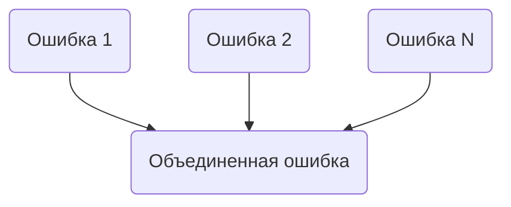

`errors.Join()` в Go появился начиная с версии 1.20 и позволяет объединять несколько ошибок в одну. Это полезно, когда нужно вернуть пользователю или в лог сразу несколько ошибок, сохранив при этом возможность проверять их с помощью `errors.Is` и `errors.As`. По сути, вызов `errors.Join(err1, err2, ...)` формирует единую ошибку, которая содержит все переданные, но при этом не теряется контекст каждой отдельной.  

Например:  
```go
err := errors.Join(io.ErrUnexpectedEOF, os.ErrClosed)
if errors.Is(err, os.ErrClosed) {
    fmt.Println("Содержит ошибку закрытого файла")
}
```

Диаграмма того, как `errors.Join` связывает ошибки:  


Таким образом `errors.Join` делает работу с несколькими ошибками чище и безопаснее, избавляя от необходимости придумывать собственные структуры для их хранения.

```old
// errors.Join()
```