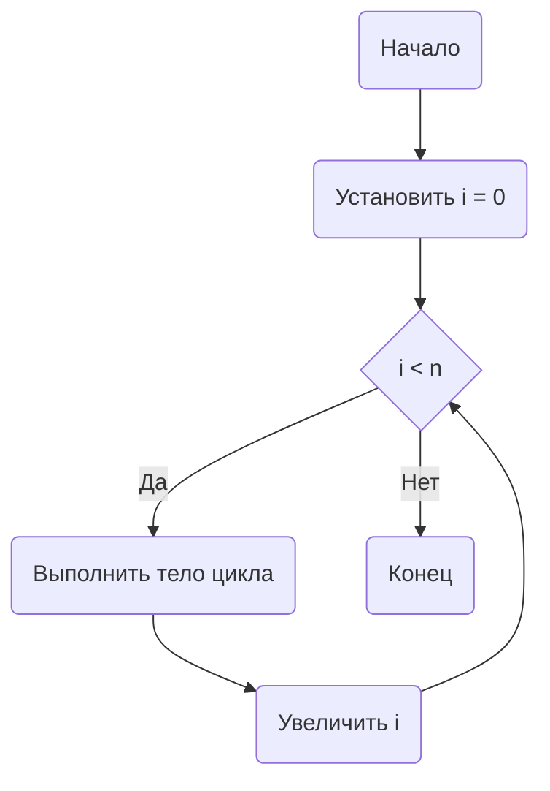

В Go начиная с версии 1.22 цикл `for i := range n` позволяет итерироваться по целому числу `n`, что упрощает запись циклов, где нужно выполнить действие определенное количество раз. Ранее для этого использовали конструкцию `for i := 0; i < n; i++`, теперь же можно лаконично писать `for i := range n`, где `i` будет принимать значения от `0` до `n-1`. Это улучшает читаемость кода и делает его более декларативным.  

Пример:  
```go
for i := range 5 {
    fmt.Println(i)
}
```
Этот код выведет числа 0, 1, 2, 3, 4.  

Диаграмма:  


```old
// for i := range n - можно выпонять инкремент по числу (начиная с 1.22)
```