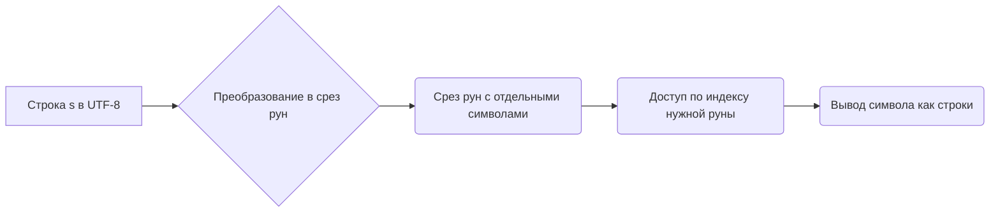

В Go строки хранятся в кодировке UTF-8, и поэтому индексирование строки напрямую работает с байтами, а не с символами. Из-за этого некоторые символы, например эмодзи или буквы из других алфавитов, могут занимать больше чем один байт. Чтобы корректно получать символы, строку преобразуют в срез рун ([]rune), где каждая руна представляет отдельный символ Юникода. После преобразования можно обращаться к элементу по индексу и снова преобразовать его в строку для вывода.  

Пример:  
```go
s := "👻abc"
runes := []rune(s)
println(string(runes[1])) // выведет 'a'
```  

Диаграмма:  


```old
// как получить руну в строке по индексу: `s := "👻abc"; runes := []rune(s); println(string(runes[1]))`
```