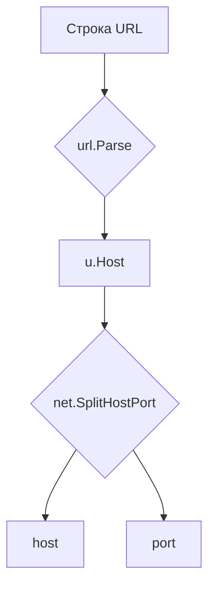

В Go при разборе строки URL через `url.Parse` поле `u.Host` содержит одновременно хост и порт, если порт присутствует. Чтобы корректно извлечь порт, используется функция `net.SplitHostPort`, которая разбивает строку на отдельные значения хоста и порта. Например:  

```go
u, _ := url.Parse("http://example.com:8080/path")
host, port, _ := net.SplitHostPort(u.Host)
fmt.Println("host:", host) // example.com
fmt.Println("port:", port) // 8080
```

Таким образом, `u.Host` нужно обязательно передать в `net.SplitHostPort`, и вы получите порт как строку. Если в URL нет порта, вызов вызовет ошибку, поэтому стоит её обрабатывать.  



```old
// u, _ := url.Parse(s); net.SplitHostPort(u.Host) - как вытащить порт
```