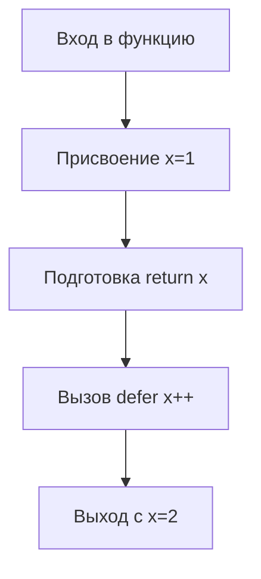

В Go `defer` выполняется уже после того, как выражение `return` вычислено, но до фактического выхода из функции. Когда функция имеет именованный результат, этот результат является переменной, которую можно изменять до завершения. В примере `x` инициализируется в `return x` как `1`, но затем отложенная функция увеличивает `x` на единицу. В итоге вернётся значение `2`.  

По сути, порядок таков:  
1. Выполняется `x = 1`.  
2. Подготавливается возврат переменной `x`.  
3. Срабатывают `defer` вызовы — `x++`.  
4. Возвращается новое значение `x`, которое равно `2`.  



```old
// func test() (x int) { defer func() { x++ }(); x = 1; return } - выведет 2
```