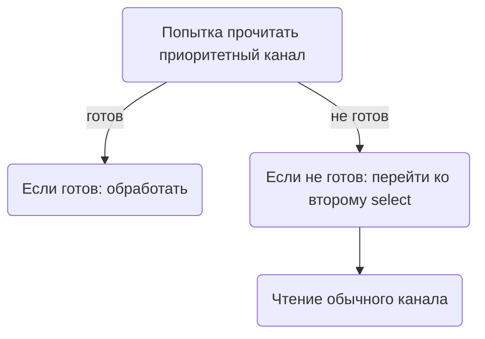

В Go оператор `select` выбирает готовый канал случайным образом, без приоритета. Это может стать проблемой, если нужно отдавать предпочтение одному каналу перед другим. Один из распространённых подходов — вложенные `select`, где в первом блоке проверяется наиболее важный канал без `default`, и только если он не готов, тогда через `default` или следующий `select` даются шансы остальным каналам. Таким образом создаётся иллюзия приоритетности.  

На [stackoverflow с вопросом](https://stackoverflow.com/questions/11117382/priority-in-go-select-statement-workaround) показан именно такой паттерн: сначала пробуют считать из «приоритетного» канала, если нет данных — переходят к остальным. Это не встроенный механизм компилятора, а лишь приём, который помогает реализовать управление порядком обработки сообщений.  

```go
select {
case msg := <-priorityCh:
    handle(msg)
default:
    select {
    case msg := <-normalCh:
        handle(msg)
    }
}
```



```old
// приоритизация в select: https://stackoverflow.com/questions/11117382/priority-in-go-select-statement-workaround
```