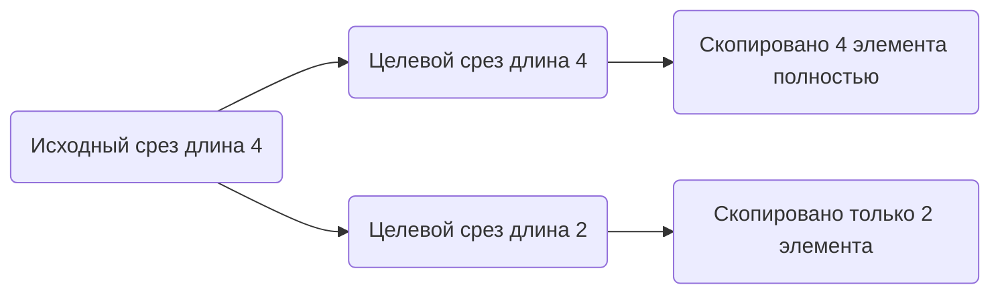

В Go функция `copy` копирует элементы из одного среза в другой и возвращает количество скопированных элементов. Однако копирование ограничивается минимальной длиной обоих срезов. Поэтому если целевой срез имеет меньшую длину, чем исходный, будет скопировано только столько элементов, сколько помещается в целевой. Чтобы выполнить полное копирование исходного среза, важно, чтобы длина целевого среза была не меньше длины исходного.  

Пример:  
```go
src := []int{1, 2, 3, 4}
dst := make([]int, len(src))
n := copy(dst, src)
// n будет равно 4, все элементы корректно скопированы
```  

Диаграмма:  


```old
// если мы хотим выполнить полное копирование через copy(), второй срез должен иметь длину больше или равную длине исходного
```