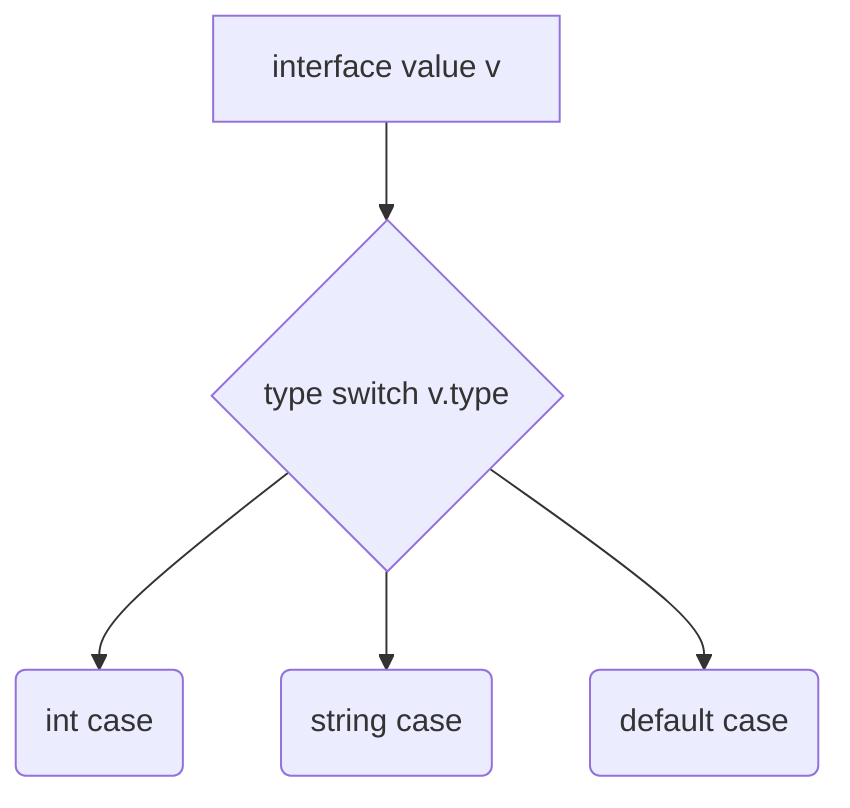

В Go конструкция `.(type)` используется исключительно внутри *type switch*. Она позволяет проверить динамический тип значения интерфейса и выполнить соответствующую ветку кода. В обычном коде вне type switch обратиться к `.(type)` нельзя — это синтаксически недопустимо.  

Пример:  
```go
func describe(v interface{}) {
    switch t := v.(type) {
    case int:
        fmt.Println("int:", t)
    case string:
        fmt.Println("string:", t)
    default:
        fmt.Println("unknown")
    }
}
```  

Диаграмма работы:  


```old
// switch t := v.(type) - .(type) работает только внутри "type switch"
```