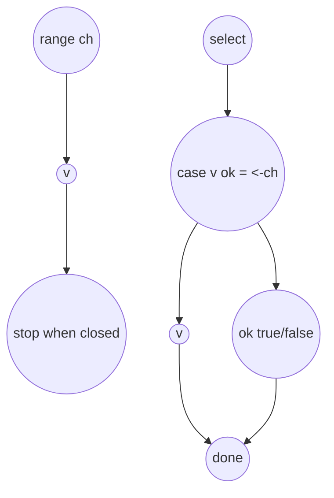

В Go при использовании `for range` канала переменная цикла может принимать только одно или два значения: само значение из канала или значение вместе с флагом `ok` при итерации по map. Для каналов эта конструкция с `ok` не существует, и компилятор выдаст ошибку. Причина в том, что `range` для каналов специально упрощен: он автоматически завершает цикл, когда канал закрыт, и не требует ручной проверки признака закрытия.  

А вот при прямом чтении из канала через `<-ch` можно облегчить себе жизнь, используя синтаксис `v, ok := <-ch`, где `ok` сообщает, был ли канал закрыт. То же правило распространяется и на `select`: внутри блока `case v, ok := <-ch:` работают обе переменные. То есть при итерации через `range` флаг закрытия встроен в саму конструкцию, а при использовании `select` нужно явно указать `ok`, если нужно знать, что канал завершен.  



```old
// `for v, ok := range ch {}` - ok для каналов не имеет смысла (не компилируется), а тут работает: `select { case v, ok := <-ch: }`
```