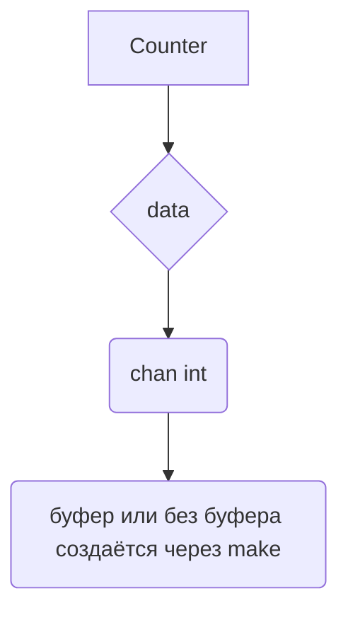

В Go важно понимать, что сам канал является значением, указывающим на структуру в рантайме, а информация о его буферизации задаётся при создании конкретного экземпляра через `make`. То есть при объявлении поля структуры или глобальной переменной можно лишь указать тип `chan int`, но невозможно зафиксировать буферизацию на уровне типа — это свойство конкретного значения. Поэтому буферизованный или небуферизованный канал определяется только при инициализации, а сама структура хранит лишь ссылку на созданный канал.  

Пример:  
```go
type Counter struct {
    data chan int
}

func NewCounter() Counter {
    return Counter{data: make(chan int, 10)} // буфер определяется здесь
}
```  

Диаграмма:  


```old
// type Counter struct { data chan int } (или var data chan int) - когда объявляем канал, не обозначить буферизированный он, или нет (т.к. буферезация - часть инстанса)
```