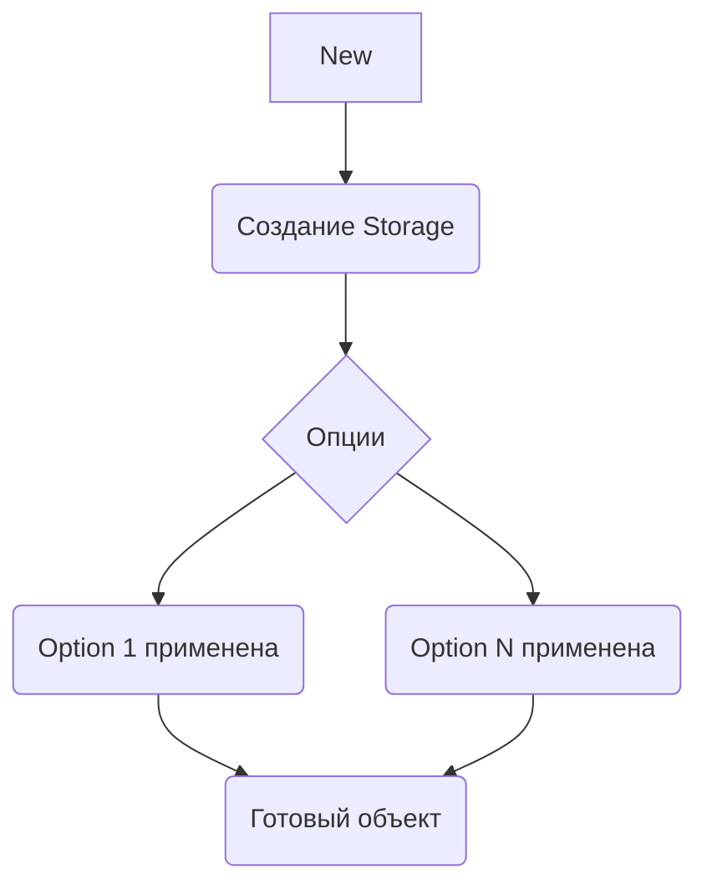

Это пример применения паттерна "функциональные опции" в Go при написании конструктора. Вместо того чтобы делать громоздкий список аргументов для настройки `Storage`, конструктор принимает базовые параметры (контекст и строку подключения), а дополнительные опции передаются в виде функций `Option`, которые настраивают объект. Такой подход улучшает читаемость кода, делает его более расширяемым и позволяет удобно добавлять новые параметры без изменения сигнатуры конструктора.  

Механика работы в том, что `Option` — это функция, принимающая указатель на `Storage` и модифицирующая его. При вызове `New`, все переданные опции поочерёдно применяются к создаваемому объекту. Таким образом можно гибко конфигурировать экземпляры, используя комбинации опций.  

Пример кода:  
```go
type Option func(*Storage)

func WithCache(size int) Option {
    return func(s *Storage) {
        s.cacheSize = size
    }
}

func New(ctx context.Context, conn string, opts ...Option) (*Storage, error) {
    s := &Storage{connString: conn}
    for _, opt := range opts {
        opt(s)
    }
    return s, nil
}
```

Диаграмма:  


```old
// func New(ctx context.Context, connectionString string, opts ...Option) (*Storage, error) - паттерн опций для конструктора в функциях
```