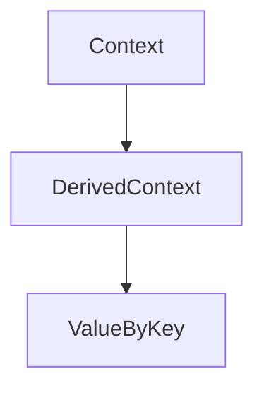

Использование пользовательского неэкспортируемого типа в качестве ключа для `context.WithValue` в Go позволяет избежать коллизий и нечаянного перезаписывания значений, так как строки или любые другие общие типы могут повторяться во внешнем коде. Это повышает безопасность и предсказуемость работы контекста.  

Пример:  
```go
package main

import (
	"context"
	"fmt"
)

type key string

const myCustomKey key = "key"

func main() {
	ctx := context.WithValue(context.Background(), myCustomKey, "val")
	fmt.Println(ctx.Value(myCustomKey)) // безопасный доступ
}
```  

Диаграмма:  


```old
// Лучшей практикой при обработке контекстных ключей будет создание неэкспортируемого пользовательского типа: `type key string; const myCustomKey key = "key"; ctx := context.WithValue(context.Background(), myCustomKey, "val")`
```