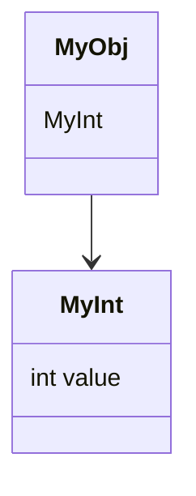

В Go можно создавать новые именованные типы на основе существующих, например так: `type MyInt int`. Такой тип отличается от `int`, хотя и имеет ту же представляемую базовую форму. Когда такой тип используется как встраиваемое (embedded) поле в структуре, он становится её составляющей и может вызываться напрямую через имя типа. Это похоже на механизм композиции — объект получает доступ к «вложенному» значению без явного имени поля.  

В приведённом примере `type MyObj struct { MyInt }`, структура содержит поле типа `MyInt`, инициализация `MyObj{1}` применяет значение к нему. Обращение `MyObj{1}.MyInt` возвращает значение из вложенного типа, демонстрируя, что именованный тип может быть встроенным полем так же, как структуры или интерфейсы.  

```go
package main

type MyInt int

type MyObj struct {
    MyInt
}

func main() {
    println(MyObj{1}.MyInt) // выводит 1
}
```



```old
// type MyInt int - "именованный тип", может применяться "анономным полем" через механизм "embedded": type MyObj struct { MyInt }; println(MyObj{1}.MyInt)
```