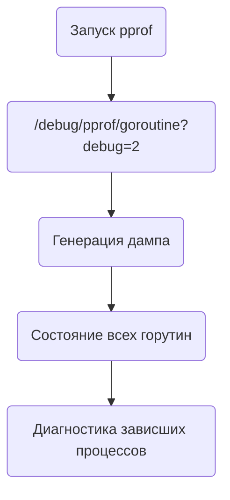

Секрет в том, что в Go можно получить полный дамп всех горутин через встроенный пакет `net/http/pprof`, перейдя по адресу `/debug/pprof/goroutine?debug=2`. Этот вывод показывает список всех активных горутин вместе с их стеками исполнения, состоянием (например, ожидание на канале) и временем блокировки. Такая диагностика помогает отлаживать «утечки горутин», когда они не завершаются и висят в состоянии ожидания.  

Пример строки `goroutine 2494290 [chan receive, 1420 minutes]` говорит, что горутина с ID 2494290 уже около 1420 минут простаивает в ожидании получения данных из канала. Это позволяет понять где программа «зависла» или чрезмерно расходует ресурсы.  



```old
// `/debug/pprof/goroutine/?debug=2` - полный дамп стека горутин: `goroutine 2494290 [chan receive, 1420 minutes]`
```