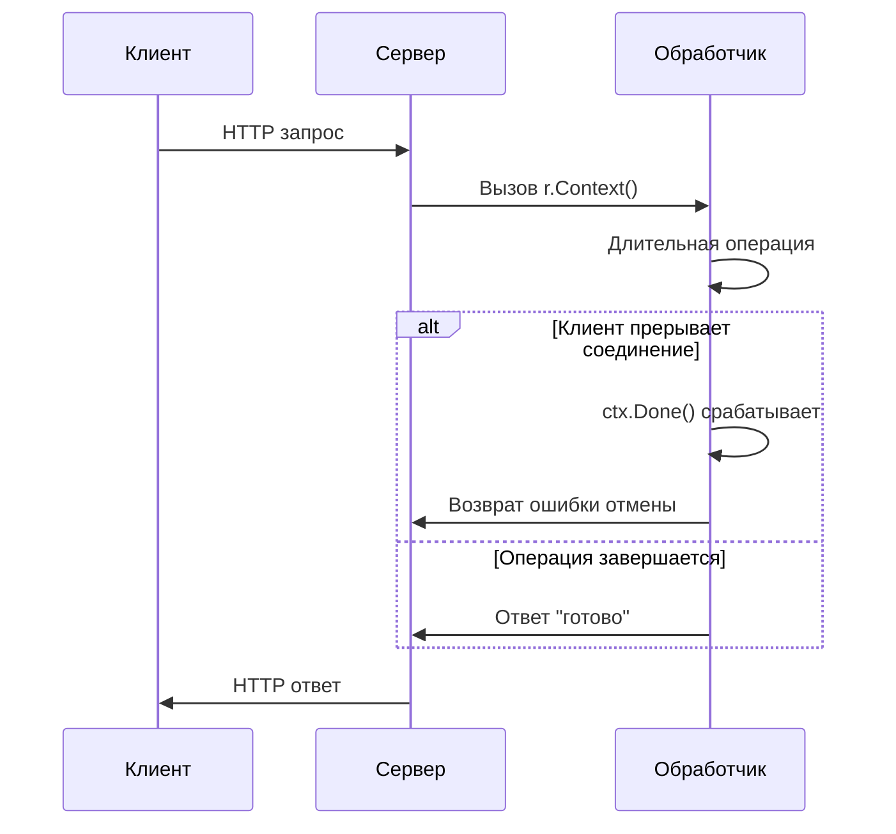

В Go у каждого входящего HTTP-запроса в http.Server есть связанный контекст r.Context(). Этот контекст автоматически привязывается к жизненному циклу запроса и закрывается, когда клиент разрывает соединение, запрос завершается или истекает таймаут. Используя r.Context(), можно безопасно отменять длительные операции или отслеживать отмену запроса. Это особенно важно при работе с базой данных или внешними сервисами — если клиент прервал запрос, то связанные операции тоже можно корректно остановить.  

Пример:  

```go
mux := http.NewServeMux()
mux.HandleFunc("/", func(w http.ResponseWriter, r *http.Request) {
    ctx := r.Context()
    select {
    case <-time.After(2 * time.Second):
        w.Write([]byte("готово"))
    case <-ctx.Done():
        http.Error(w, "запрос отменен", http.StatusRequestTimeout)
    }
})
http.ListenAndServe(":8080", mux)
```  

Диаграмма:  



```old
// вызов r.Context() внутри обработчика для http.NewServeMux()
```