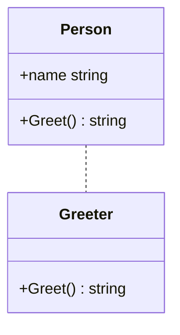

В Go реализация интерфейса происходит неявно: если тип имеет все методы, требуемые интерфейсом, то он автоматически считается реализующим этот интерфейс. Это избавляет от явных связок и уменьшает связанность кода, но одновременно делает код менее самодокументированным, потому что нигде прямо не указано, что конкретная структура предназначена реализовывать интерфейс.  

Такой дизайн выбран для упрощения композиции и повышения гибкости: программист может создавать интерфейсы даже после написания типов, и старый код начнет автоматически удовлетворять новым интерфейсам без изменений. Однако это может затруднять чтение кода, поскольку приходится дополнительно проверять соответствие методов интерфейсу.  

```go
package main

import "fmt"

type Greeter interface {
    Greet() string
}

type Person struct {
    name string
}

// Person реализует Greeter автоматически,
// так как определен метод Greet
func (p Person) Greet() string {
    return "Hello, " + p.name
}

func main() {
    var g Greeter = Person{name: "Go"}
    fmt.Println(g.Greet())
}
```  



```old
// что не нравится в Go? имплементация методов интерфейса в отрыве от объявления интерфейса, т.е. отсутствует самодокументирование кода, как например в Dart: class MyClass implements MyInterface {}
```