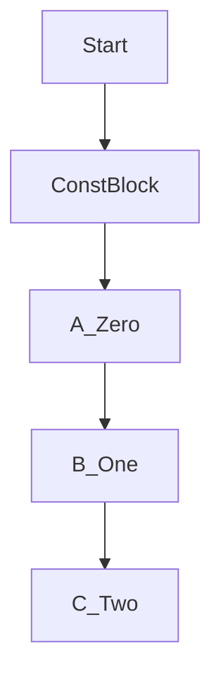

`iota` в Go — это встроенный идентификатор, который используется при объявлении последовательностей констант. Он автоматически увеличивается на единицу внутри блока `const`, начиная с нуля. Это позволяет легко задавать перечни констант без ручного задания значений, а также упрощает создание битовых масок или смещений.  

Например, в блоке `const` первая константа получит значение 0, следующая — 1, и так далее, если явно не указано иное. Это делает `iota` удобным инструментом для нумерации и генерации предсказуемых значений без лишнего кода.  

```go
package main

import "fmt"

const (
    A = iota
    B
    C
)

func main() {
    fmt.Println(A, B, C) // 0 1 2
}
```



```old
// генератор констант iota
```