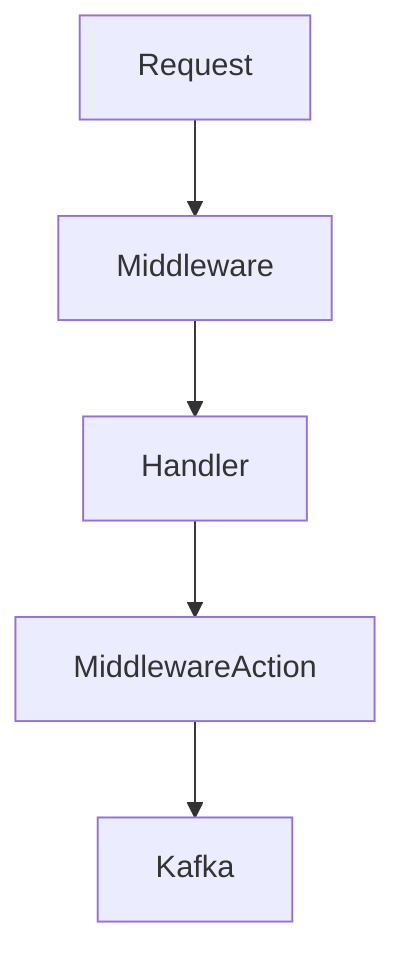

В Go часто применяют middleware для обработки запроса до и после выполнения основного хендлера. Секрет здесь в том, что сначала нужно пропустить запрос дальше по цепочке через `next.ServeHTTP(w, r)`, чтобы основной обработчик выполнился, а уже потом безопасно брать данные из контекста и использовать их, например, для записи в Kafka. Такой порядок гарантирует, что бизнес‑логика полностью отработала, и логирование или отправка сообщений будет отражать итоговое состояние.  

Если выполнить запись в Kafka до вызова `next.ServeHTTP`, то можно столкнуться с несогласованностью данных или преждевременной логикой. Таким образом middleware оборачивает хендлер, обеспечивает расширяемость и поддерживаемость кода, а Kafka используется как асинхронный канал событий после завершения обработки запроса.  

```go
func KafkaMiddleware(next http.Handler) http.Handler {
    return http.HandlerFunc(func(w http.ResponseWriter, r *http.Request) {
        next.ServeHTTP(w, r)
        data := r.Context().Value("someKey")
        go sendToKafka(data)
    })
}
```



```old
// данные из контекста обычно вытаскивают в middleware - сначала делаем next.ServeHTTP(w, r), потом пишем в кафку
```