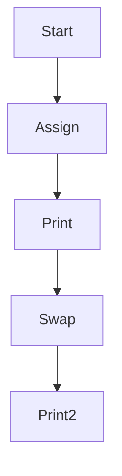

В Go такой приём называется **множественное присваивание**. Он позволяет за одно выражение присвоить значения сразу нескольким переменным. В отличие от Python, где это называется «присваивание кортежу», в Go нет кортежей как отдельного типа — значения просто распределяются по переменным в порядке слева направо. Это удобно для одновременной инициализации или обмена значениями.  

Пример:  
```go
package main

import "fmt"

func main() {
    x, y := "1", 2
    fmt.Println(x, y) // выведет: 1 2

    x, y = y, x       // множественное присваивание для обмена значений
    fmt.Println(x, y) // выведет: 2 1
}
```  

Диаграмма действий:  


```old
// x, y = "1", 2 - называется "присваивание кортежу" в Python, но в GoLang это "множественное присваивание"
```