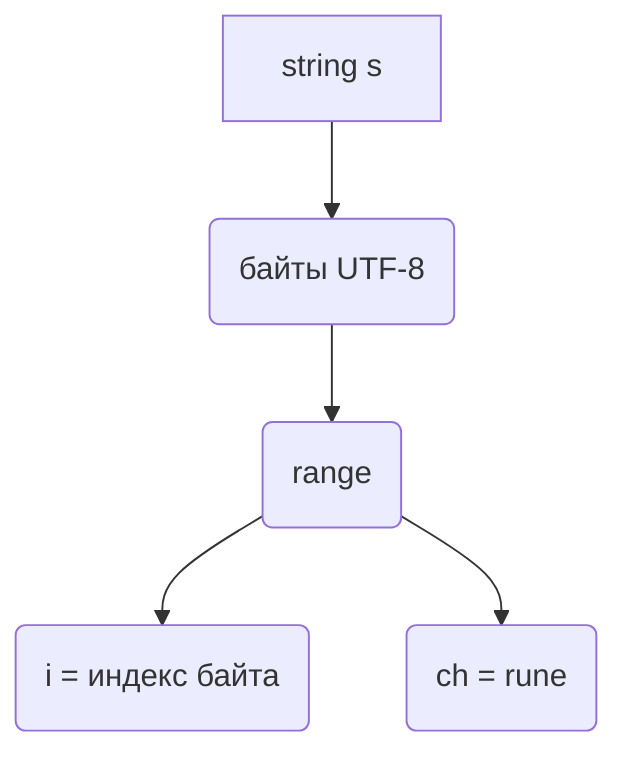

В Go цикл `for range` при обходе строки работает на уровне рун: каждая итерация возвращает `ch` — это значение руны (`rune`, то есть Unicode code point), а переменная `i` — это индекс байта, с которого начинается данная руна в строке. Поскольку строки в Go хранятся в UTF-8, одна руна может занимать от 1 до 4 байт, и потому `i` не является номером "символа по счёту", а именно байтовой позицией в срезе байтов.  

Это означает, что при работе со строками важно различать индекс символа и индекс байта: если строка содержит только ASCII, то они совпадут, но при наличии многобайтовых символов (например, кириллицы или эмодзи) `i` будет указывать на смещение внутри массива байтов, а не на "номер буквы".  

Краткая иллюстрация:  

```go
s := "Go语言"
for i, ch := range s {
    fmt.Printf("i=%d ch=%c\n", i, ch)
}
```

Диаграмма:  



```old
// for i, ch := range s {} "go" - ch имеет тип rune, s имеет тип string (т.е. range итерирует строку рунами); но i возвращает не индекс руны, а начальный индекс руны в []byte(s)
```