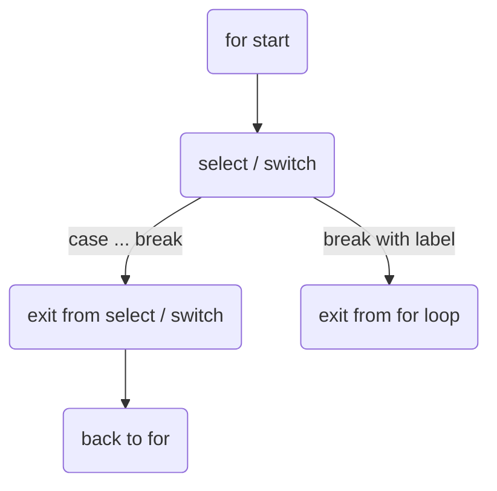

В Go оператор `break` внутри `case` конструкции `select` или `switch` завершает именно выполнение этой конструкции, а не внешний цикл. Это означает, что если `select` или `switch` находятся внутри цикла `for`, то `break` не выйдет из цикла, а лишь закроет текущий `select` или `switch`, после чего управление вернется обратно в цикл. Чтобы действительно выйти из `for`, используют метку цикла и `break` с этой меткой.  

Пример:  

```go
Loop:
for {
    select {
    case <-ch:
        break Loop // выйдем из всего цикла
    default:
        break // выйдем только из select, но не из for
    }
}
```

Диаграмма:  


```old
// break внутри case в select / switch - выйдут из области видимости select / switch (а не прервут for)
```