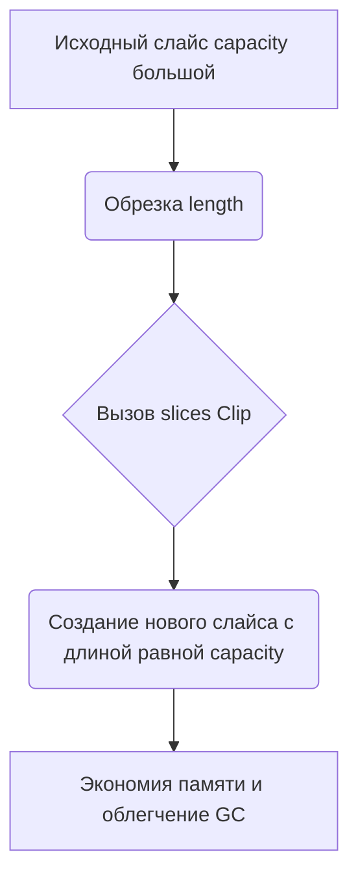

Функция `slices.Clip`, появившаяся в Go 1.21, уменьшает capacity слайса до его фактической длины, тем самым устраняя «запас» неиспользуемой памяти. Это полезно, когда временно работали с большими данными (например 10 Мб), но после уменьшения слайса по длине память всё ещё удерживается из-за прежней capacity. Вызов `slices.Clip` создаст новый слайс с тем же содержимым, но сжатым capacity.  

В результате мы экономим память и снижаем давление на GC, что особенно важно в высоконагруженных системах. Такой приём позволяет эффективно сбрасывать лишнюю аллокацию, сохраняя корректность данных.  

```go
package main

import (
    "fmt"
    "slices"
)

func main() {
    data := make([]int, 0, 1000)
    data = append(data, 1, 2, 3)
    fmt.Println(len(data), cap(data)) // 3 1000

    data = slices.Clip(data)
    fmt.Println(len(data), cap(data)) // 3 3
}
```  



Источник: https://www.youtube.com/watch?v=G-lhh_1XNcI — в ролике объясняется, как `slices.Clip` помогает управлять скрытой избыточной памятью в слайсах и показывает практические примеры оптимизации.

```old
// slices.Clip (начиная с 1.21) - уменьшает capacity слайса до его текущей длины - имеет смысл пробовать после 10Мб https://www.youtube.com/watch?v=G-lhh_1XNcI
```