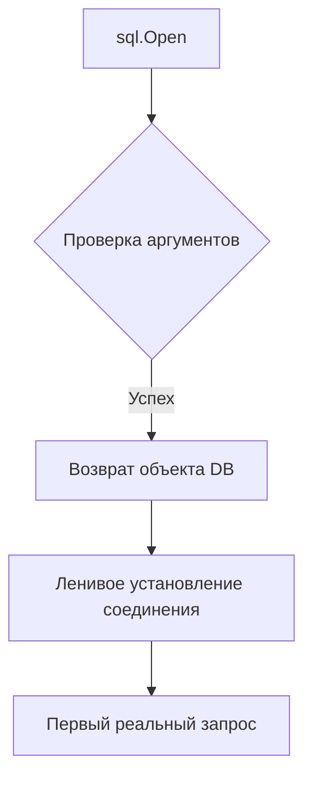

В Go функция `sql.Open` не устанавливает реального соединения с базой данных, а лишь проверяет правильность параметров и настраивает объект-пул. Настоящее подключение создаётся лениво, только при первом обращении к базе, например при выполнении запроса.  

Чтобы убедиться, что база доступна и соединение реально устанавливается, нужно вызвать метод `db.Ping()` или `db.PingContext()`. Это гарантирует проверку физического подключения, в отличие от простого вызова `sql.Open`, который может вернуть успех даже при недоступной базе.  

```go
db, err := sql.Open("postgres", connStr)
if err != nil {
    log.Fatal(err)
}
if err := db.Ping(); err != nil {
    log.Fatal("DB недоступна:", err)
}
```



```old
// sql.Open может просто проверять правильность и действительность своих аргументов, не создавая соединение с базой данных (первое соединение может быть открыто лениво). Чтобы убедиться в доступности БД, применяйте метод Ping/PingContext.
```