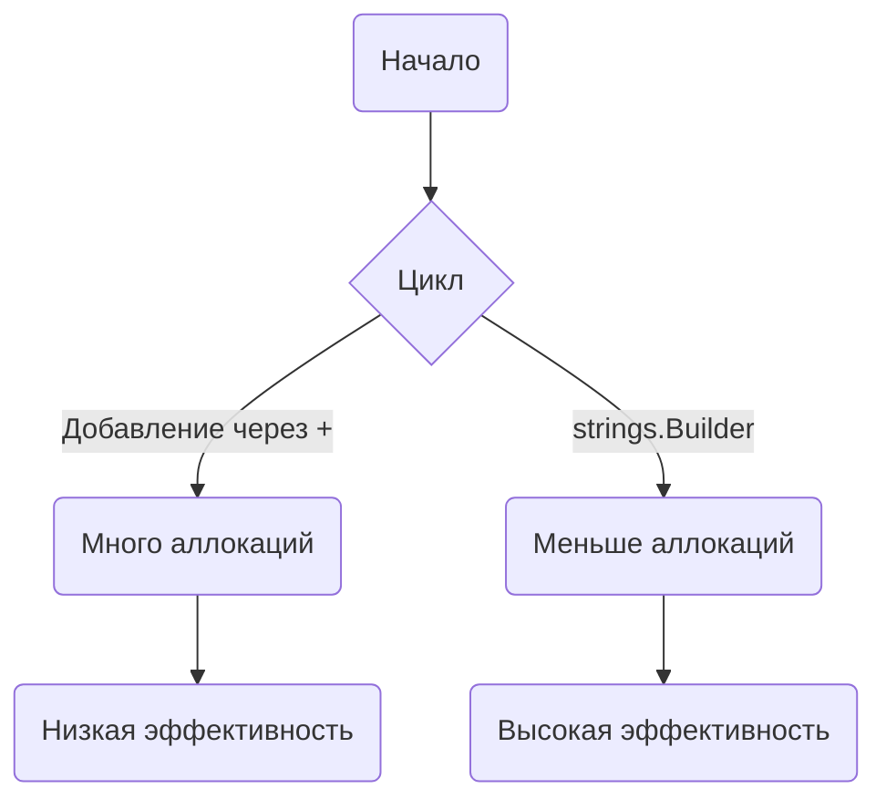

В Go при конкатенации строк внутри цикла использование оператора `+` или `+=` может приводить к лишним аллокациям и снижению производительности, особенно если строк больше пяти. Для эффективного объединения строк в таких сценариях лучше применять `strings.Builder`, так как он минимизирует количество выделений памяти и работает быстрее благодаря буферу. Методы `WriteString`, `Write`, `WriteByte` и `WriteRune` позволяют записывать данные разных типов в строку, а `Grow` может заранее увеличить емкость буфера, уменьшая количество перераспределений памяти.  

Пример:  
```go
package main

import (
	"fmt"
	"strings"
)

func main() {
	var b strings.Builder
	b.Grow(100) // заранее резервируем память
	for i := 0; i < 10; i++ {
		b.WriteString("строка ")
	}
	fmt.Println(b.String())
}
```  

Диаграмма:  


```old
// для конкаценации строк в циклах (более 5 строк) лучше использовать strings.Builder и его методы: .WriteString, .Write, .WriteByte, .WriteRune, .Grow (будущая длина среза / capacity)
```