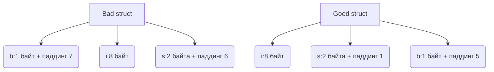

В Go структура выравнивается по наибольшему размеру её полей, и внутри неё добавляются "пустые" байты для соблюдения этого порядка. Если поля расположены неэффективно, то суммарный размер структуры может оказаться значительно больше, чем размер самих данных. Чтобы уменьшить перерасход памяти, поля стоит упорядочивать по убыванию размера их типов — сначала `int64`, затем `int32`, потом `int16` и так далее. Это минимизирует количество вставляемых компилятором выравнивающих «паддингов».  

Пример:  

```go
type Bad struct {
    b byte
    i int64
    s int16
}

type Good struct {
    i int64
    s int16
    b byte
}
```



В результате «Bad» занимает больше памяти, чем «Good», хотя набор полей одинаков. Таким образом правильная организация структур экономит память и улучшает кэш‑локальность.

```old
// Как уменьшить объем резервируемой памяти под выравнивания? Эмпирическое правило: реорганизовать структуру так, чтобы ее поля сортировались по размеру типов в порядке убывания.
```