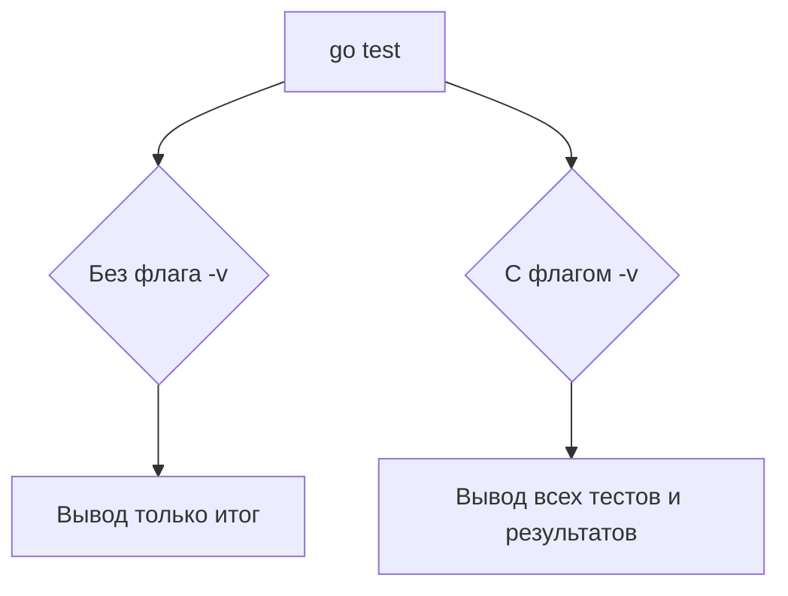

Флаг `-v` в команде `go test -v` включает подробный режим выполнения тестов. В обычном режиме `go test` выводит только итоговый результат — успешно ли прошли тесты и ошибки. Однако при использовании `-v` отображаются имена каждого выполняемого теста и результат по каждому из них. Это удобно для отладки, когда нужно понять порядок исполнения и на каком именно тесте возникла проблема.  

На диаграмме можно увидеть процесс тестирования в обычном и подробном режиме:  



```old
// go test -v - флаг -v отображает прохождение тестов
```