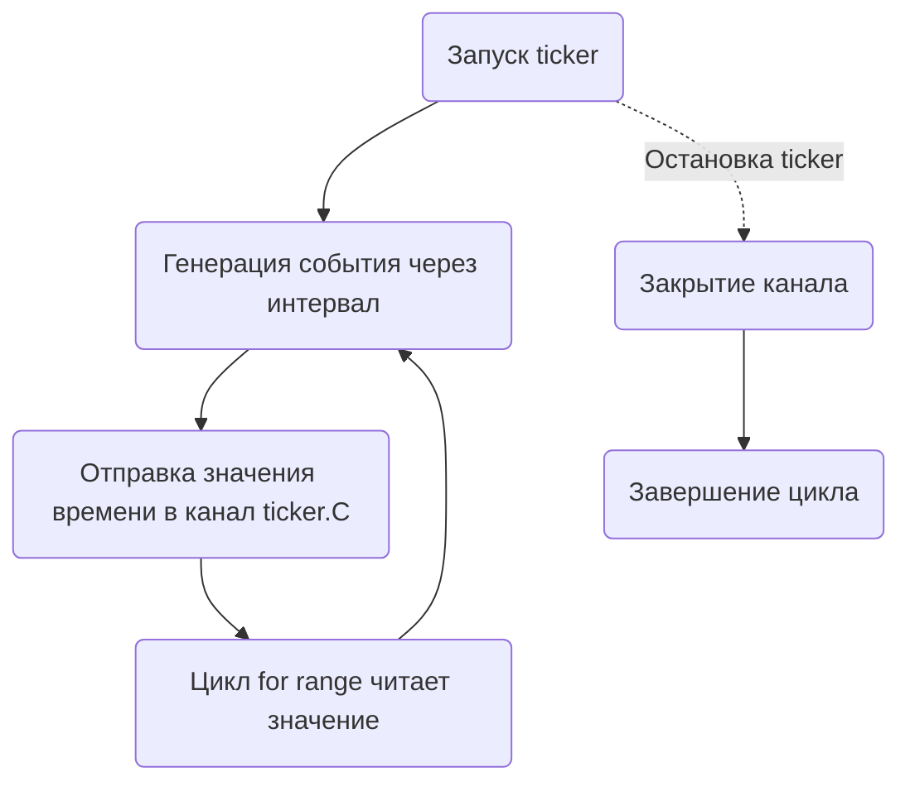

Секрет цикла `for t := range ticker.C {}` в Go заключается в том, что `ticker.C` — это канал, в который таймер `time.Ticker` автоматически отправляет текущее время через равные промежутки. Конструкция `for range` позволяет непрерывно читать из этого канала: каждый раз, когда тикер срабатывает, в `t` попадает значение времени. Таким образом, цикл будет выполняться до тех пор, пока сам тикер не будет остановлен с помощью `ticker.Stop()`, после чего канал закроется, и цикл завершится.  

Диаграмма демонстрирует поток работы:  



```old
// for t := range ticker.C {} - чтение из канала ticker.C
```