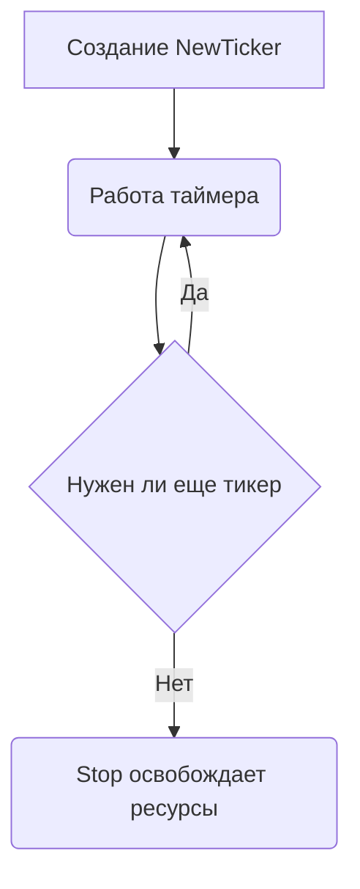

Функция `time.Tick()` удобна, но она создает внутренний `time.Ticker`, который невозможно остановить, так как возвращает только канал. Это приводит к утечке ресурсов при долгом использовании — таймер продолжает работать, даже если канал больше не читается.  

Правильный подход — использовать `time.NewTicker()`, который возвращает сам тикер и предоставляет метод `Stop()`. Это позволяет управлять его жизненным циклом и корректно освобождать ресурсы.  

```go
ticker := time.NewTicker(time.Second)
defer ticker.Stop()
for t := range ticker.C {
    fmt.Println("tick at", t)
}
```



```old
// time.Tick() - лучше не использовать, it "leaks"; вместо него NewTicker() + Stop()
```