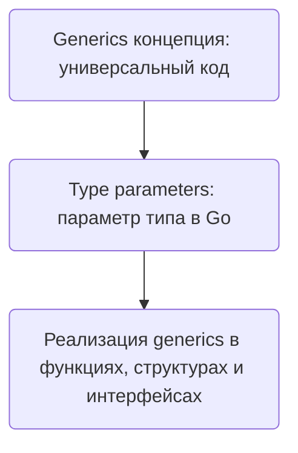

В Go есть различие между понятиями *generics* и *type parameters*. Generics — это общее название для возможности писать универсальный код, который работает с разными типами данных без дублирования. Type parameters — это конкретный инструмент реализации generics в Go: они позволяют объявлять функции, методы или типы с параметрами типов, которые затем можно подставлять при использовании. То есть generics — это идея, а type parameters — часть синтаксиса и механизма, позволяющего этой идее работать в Go.  

Пример:  

```go
func Max[T comparable](a, b T) T {
    if a > b {
        return a
    }
    return b
}
```  

Здесь `T` — type parameter, а сама возможность писать такую универсальную функцию — это generics.  



```old
// type parameters VS generics - зачем два термина? Таким образом, “type parameters” и “generics” относятся к различным аспектам одной и той же функциональности. “Generics” относится к общей концепции написания кода, который может работать с различными типами, в то время как “type parameters” относится к конкретному механизму, используемому для реализации этой функциональности.
```