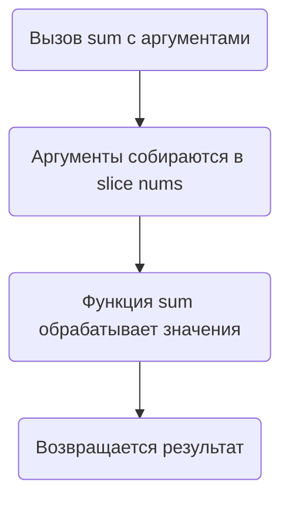

В Go существует понятие вариативных функций — это функции, которые принимают переменное количество аргументов. Объявляются они через синтаксис `func sum(nums ...int)`, где `...int` означает, что в функцию можно передавать любое количество целых чисел. Внутри функции эти аргументы доступны как слайс `[]int`.  

При вызове функции можно либо перечислить аргументы напрямую (`sum(1, 2, 3)`), либо передать уже готовый слайс с использованием оператора `...` для его "распаковки":  
```go
nums := []int{1, 2, 3}
sum(nums...)
```

Диаграмма для наглядности:  


```old
// sum(nums ...int) - вариативная функция (variadic function), где nums - слайс, ... - spread operator; sum(nums...) - при вызове тоже можно использовать ... - slice unpacking
```