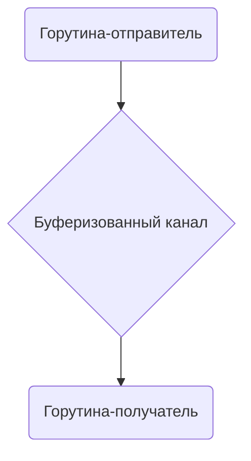

В Go отличие буферизованного канала от небуферизованного заключается в том, что отправка в него не блокирует горутину сразу: пока в буфере есть место, данные можно поместить, даже если получателя ещё нет. То есть `make(chan string, 1)` создаёт канал ёмкостью в один элемент, и первая отправка в такой канал выполняется без ожидания, а блокировка наступает только если буфер заполнен. Таким образом становится возможным развязать по времени операции записи и чтения, что упрощает организацию конкурентных процессов.  

```go
package main

import "fmt"

func main() {
    bufferedCh := make(chan string, 1)
    bufferedCh <- "привет" // не блокируется, хотя приёмника ещё нет
    
    fmt.Println(<-bufferedCh) // получатель извлекает сообщение
}
```



```old
// bufferedCh := make(chan string, 1) - неблокирует передатчик, пока не готов приёмник
```