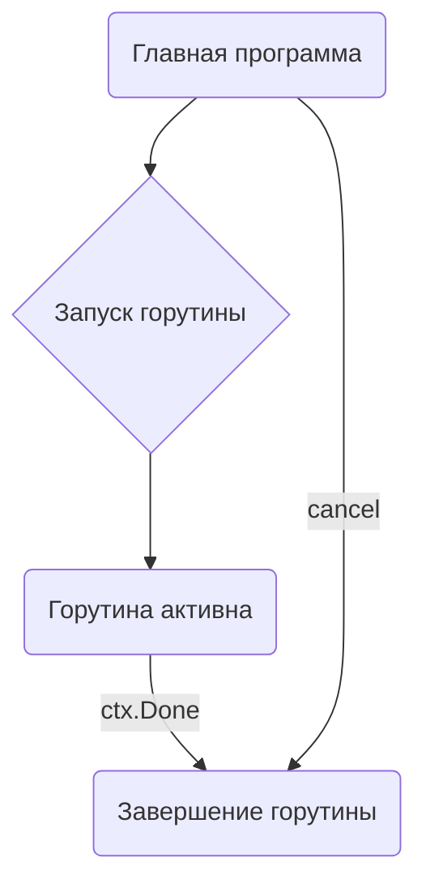

В Go горутины не имеют встроенного механизма автоматического завершения, поэтому они действительно могут вести себя как "утечки", если не предусмотреть их корректное завершение. В отличие от `defer`, который используется для высвобождения ресурсов вроде файлов или мьютексов, для горутин приходится явно проектировать протокол завершения с помощью каналов, контекста (`context.Context`) или сигналов. Это означает, что программист несет ответственность за то, чтобы каждая горутина знала, когда пора выйти, иначе она продолжит работать и удерживать ресурсы.  

На практике часто применяют `context.WithCancel`, который позволяет создать общий сигнал остановки и аккуратно завершить все работающие горутины. Это избавляет от "зависших" фоновых задач и делает код предсказуемее.  

```go
ctx, cancel := context.WithCancel(context.Background())
go func() {
    defer fmt.Println("goroutine stopped")
    for {
        select {
        case <-ctx.Done():
            return
        default:
            time.Sleep(100 * time.Millisecond)
        }
    }
}()
// ...
cancel() // сообщает горутине завершиться
```  



```old
// что не нравится в Go? Горутина — это такой же ресурс, как и любой другой, который должен быть закрыт для освобождения памяти или других ресурсов. При этом нет какого-либо идеоматичного решения, типа как defer для освобождения ресурсов.
```