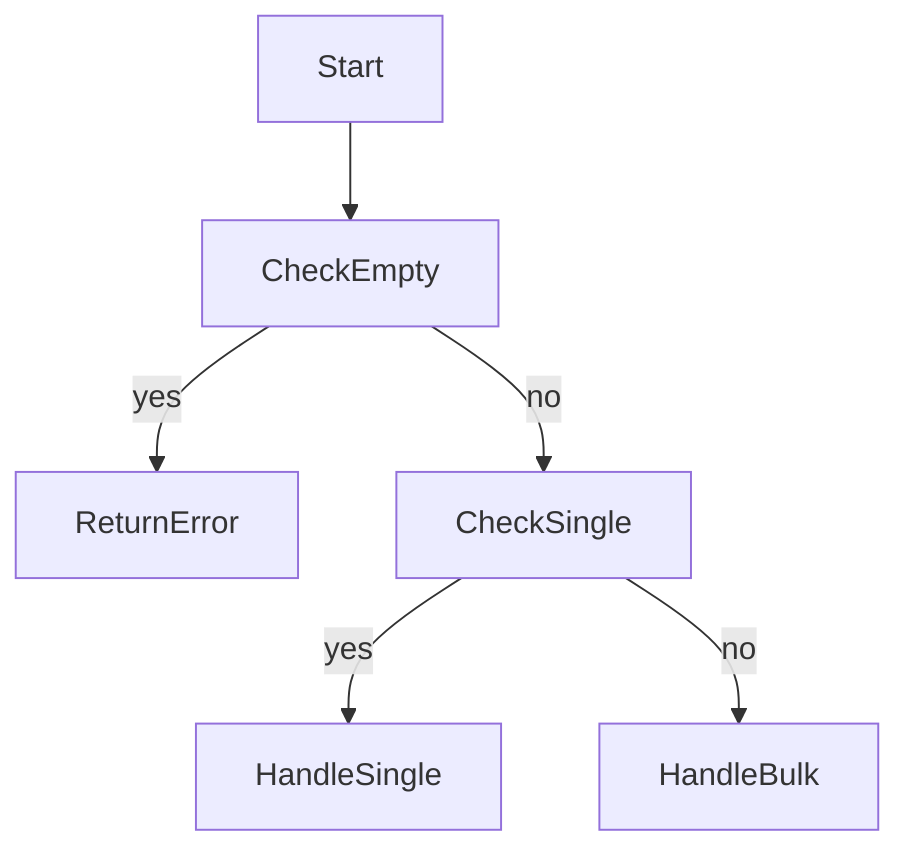

Guard clauses в Go помогают упростить функции: вместо вложенного набора if-блоков сразу проверяются исключительные или граничные условия и при их выполнении происходит немедленный выход из функции. Это делает код линейным и читаемым, избавляет от лишней вложенности и концентрирует внимание на "основном пути".  

Кроме того, guard clauses хорошо сочетаются с концепцией fast-path, когда наиболее частый или быстрый сценарий исполнения проверяется и обрабатывается сразу. Это позволяет компилятору и процессору эффективнее оптимизировать код, улучшая предсказуемость ветвлений и производительность.  

```go
func process(data []int) error {
    if len(data) == 0 {
        return errors.New("empty data")
    }
    if len(data) == 1 {
        return handleSingle(data[0])
    }
    return handleBulk(data)
}
```



```old
// guard clauses - "защитные оговорки", это когда в теле функции сначала проверяю условия и выхожу при их обнаружении, а только потом вычисляю основной вариант (вместо вложенного ветвления if-ов); а ещё это полезно для концепции встраивания быстрого пути (fast-path inlining)
```