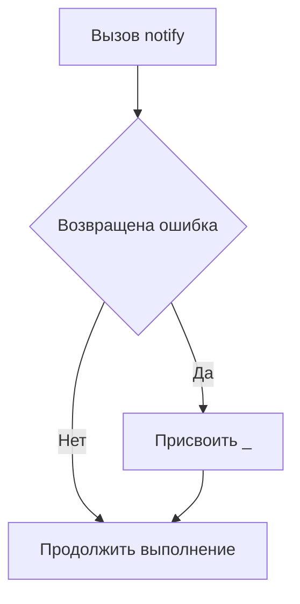

В Go ошибки — это обычные значения, которые возвращаются функциями. Если функция возвращает ошибку, но программист уверен, что её нужно проигнорировать, это делается явно через присвоение пустому идентификатору: `_ = notify()`. Такой подход подчёркивает, что ошибка не забыта случайно, а осознанно проигнорирована. Это улучшает читаемость кода и делает намерения программиста очевидными.  

Например:  
```go
func main() {
    _ = notify() // ошибка игнорируется намеренно
}
```  

Диаграмма потока:  


```old
// если вы уверены, что ошибку можно и нужно игнорировать, то делайте это явно, присвоив ее пустому идентификатору. `_ = notify()` где `func notify() error`
```