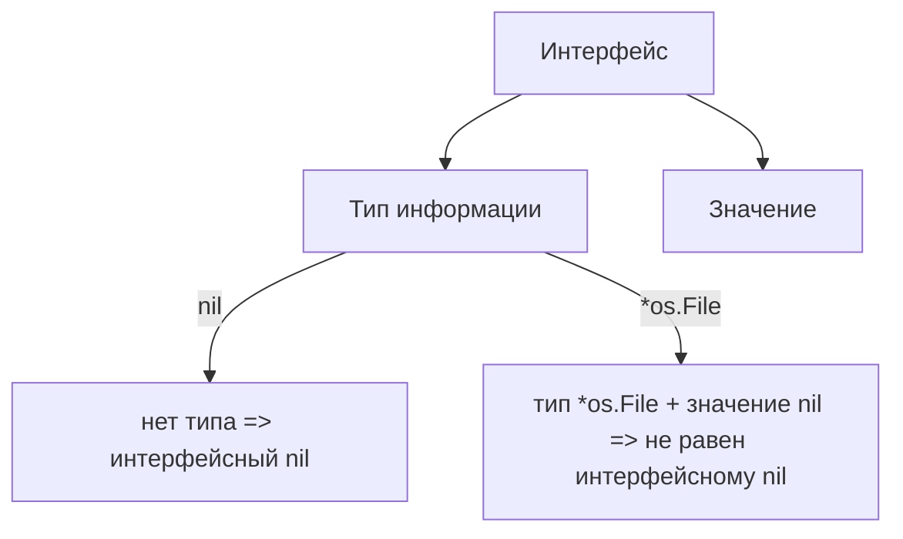

В Go важно различать **типизированный nil** и **интерфейсный nil**. Когда мы пишем `var w *os.File = nil`, переменная получает конкретный тип `*os.File` и значение nil. Но когда мы объявляем `var w io.Writer = nil`, то это уже интерфейс, и в таком случае у переменной нет ни метода, ни информации о типе, поэтому это «пустой интерфейсный nil». Если же мы присвоим интерфейсу `w` значение, например `(*os.File)(nil)`, то у интерфейса будет лежать конкретный тип и «nil-значение» этого типа, что уже не равно чистому интерфейсному nil.  

Таким образом, интерфейсное сравнение с nil бывает неожиданным: `w == nil` может оказаться `false`, если у интерфейса есть тип но под капотом значение nil. Это часто вызывает ошибки при проверке, так как интерфейс хранит пару (тип, значение).  

```go
package main

import (
	"fmt"
	"io"
	"os"
)

func main() {
	var w io.Writer
	fmt.Println(w == nil) // true

	w = (*os.File)(nil)
	fmt.Println(w == nil) // false, так как тип установлен
}
```  



```old
// интерфейсный тип не даёт типизированный nil: var w io.Writer = nil // <nil> VS var w *os.File = nil // (*os.File)(nil)
```