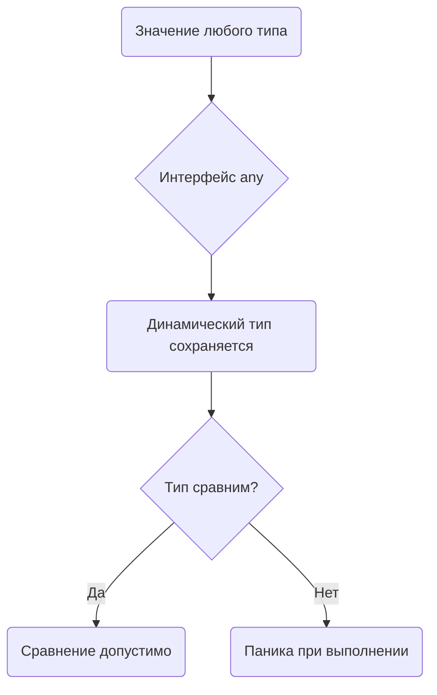

В Go при сравнении значений интерфейсов происходит проверка как типов, так и самих значений. В примере `var x any = []int{1, 2, 3}; println(x == x)` ошибка заключается в том, что срезы в Go несравнимы напрямую, поэтому при помещении среза в `interface{}` попытка выполнить `x == x` приводит к панике во время выполнения, а не к компиляционной ошибке. Это связано с тем, что два значения интерфейса можно сравнивать только в случае, если их динамические значения принадлежат сравнимым типам.  

Такую проблему может отлавливать линтер **staticcheck** (правило `SA1130` и смежные проверки), который анализирует сравнения интерфейсов и предупреждает, если они могут привести к ошибкам времени выполнения. Подсказка: сравнивать интерфейсы безопасно только тогда, когда динамический тип гарантированно сравним.  

Диаграмма в mermaid для визуализации:  



```old
// var x any = []int{1, 2, 3}; println(x == x) - какой линтер может отлавливать эту ситуацию? Сравнивайте значения интерфейсов, только если вы уверены, что они содержат динамические значения сравниваемых типов.
```