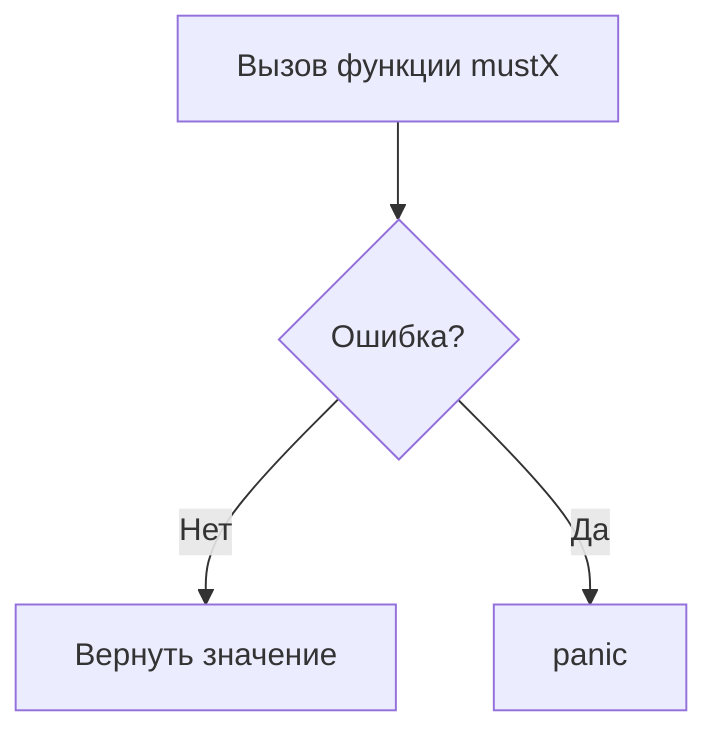

Префикс `must` в Go используется для функций, которые гарантируют выполнение задачи, но при ошибке сразу завершают программу через `panic`. Такой подход применяется тогда, когда ошибка считается фатальной и продолжение работы приложения невозможно. Это упрощает код, убирая лишнюю обработку ошибок там, где их не предполагается корректно решать.  

Например, в стандартной библиотеке можно встретить `template.Must`, которая проверяет успешную компиляцию шаблона, и если произошла ошибка — вызывает `panic`. Это считается идиоматическим приёмом Go, когда важно сразу «провалиться» при некорректной инициализации.  

```go
t := template.Must(template.New("name").Parse("Hello, {{.}}!"))
```  

Диаграмма:  



```old
// префикс must обычно используется в функциях, которые могут вызвать панику
```