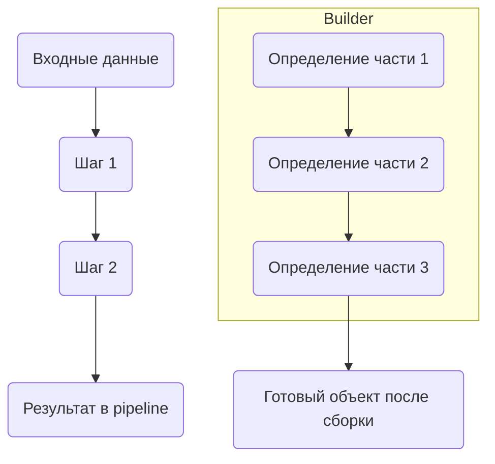

Pipeline и Builder оба работают с последовательностью шагов, но их суть различается. Pipeline пропускает данные через цепочку обработчиков, где результат одного шага сразу поступает на вход следующему и может быть использован по ходу выполнения. Это похоже на конвейер в производстве — данные «текут» и обрабатываются последовательно.  

Builder же скрывает промежуточные состояния и управляет поэтапным созданием сложного объекта. Только после завершения всех нужных шагов предоставляется готовый результат. В этом смысле можно представить builder как «закрытый pipeline», где процесс сборки невидим, а доступ есть лишь к итоговому объекту.  



```old
// в чем разница между pipeline и builder? Паттерн "Строитель" скрывает объект до тех пор, пока он не построен до конца (т.е. можно сказать, что builder - это pipeline за закрытыми дверями; хотя оба паттерна имеют дело с последовательностью шагов, они используются в разных сценариях и служат разным целям).
```