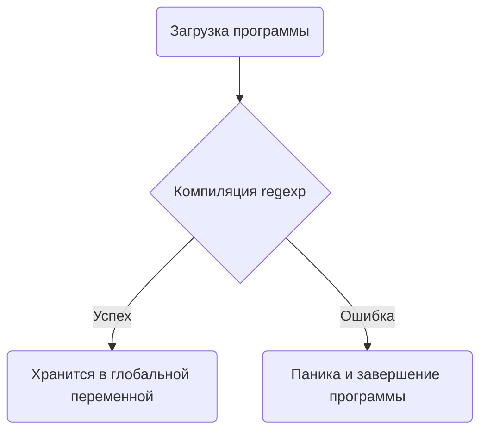

Использование `regexp.MustCompile()` удобно для инициализации глобальных переменных, потому что оно вызывает панику при ошибке компиляции регулярного выражения сразу на этапе загрузки программы. Это гарантирует, что программа не продолжит работу с некорректным паттерном. В отличие от `regexp.Compile()`, которое возвращает ошибку и требует дополнительной обработки, `MustCompile()` упрощает код и делает инициализацию «безошибочной» на старте.  

По сути, такой подход позволяет определить регулярные выражения как константные структуры, доступные по всему коду без необходимости писать проверку ошибок каждый раз, когда они используются. Это делает код чище и безопаснее, так как ошибки в шаблонах выявляются немедленно при запуске.  

```go
package main

import (
    "fmt"
    "regexp"
)

var re = regexp.MustCompile(`\d+`)

func main() {
    fmt.Println(re.MatchString("123"))
}
```  



```old
// regexp.MustCompile() для глобальных переменных вместо regexp.Compile()
```