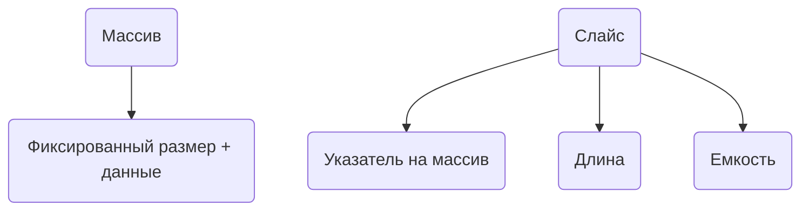

В Go массивы являются значимыми типами, и оператор `==` сравнивает их поэлементно, если размер и элементы совпадают. Поэтому выражение `[3]int{1,2,3} == [3]int{1,2,3}` возвращает `true`. Слайсы же — это структуры, содержащие указатель на массив, длину и емкость; при сравнении через `==` они сравниваются как ссылки, а не по содержимому. В результате `[]int{1,2,3} == []int{1,2,3}` недопустимо, потому что это разные объекты, и язык запрещает их прямое сопоставление таким образом.  

Чтобы проверить равенство содержимого слайсов, в Go используют функции вроде `reflect.DeepEqual` или собственную реализацию сравнения поэлементно.  

```go
package main

import (
	"fmt"
	"reflect"
)

func main() {
	a := []int{1, 2, 3}
	b := []int{1, 2, 3}
	fmt.Println(reflect.DeepEqual(a, b)) // true
}
```  



```old
// Нельзя сравнивать []int{1,2,3} == []int{1,2,3}, в отличии от [3]int{1,2,3} == [3]int{1,2,3}
```