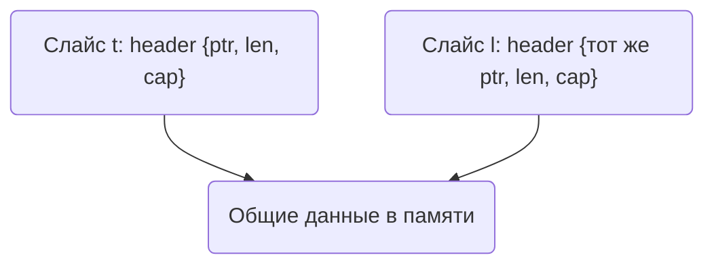

В Go выражение `l := t[:]` создаёт новый срез, который указывает на тот же участок памяти, что и первоначальный массив или срез `t`. При этом `unsafe.Pointer`, указывающий на исходные данные, не изменяется, так как данные остаются в том же месте памяти — меняется лишь структура среза, которая хранит длину и ёмкость. Это означает, что `t` и `l` независимы как срезы, но разделяют одни и те же элементы в памяти.  

Иными словами, операция `[:]` копирует заголовок среза, но не сами элементы, поэтому адрес массива (и `unsafe.Pointer` на него) остаётся неизменным. Из-за этого изменения элементов через `l` будут видны и через `t`, и наоборот, до тех пор, пока не произойдёт перераспределение памяти при расширении.  



```old
// l := t[:] - не меняет unsafe.Pointer
```