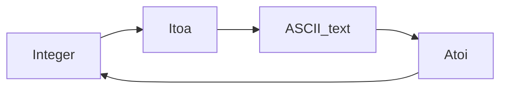

`Itoa` и `Atoi` из пакета `strconv` легко различить, если помнить их смысл: `Itoa` означает **Integer to ASCII**, то есть преобразует число в строку. Соответственно, `Atoi` — **ASCII to Integer**, превращает строку в число. Так можно держать в голове простое взаимное отображение: `Itoa` работает при выводе чисел в человекочитаемом виде, а `Atoi` при разборе строк в численные значения.  

Пример:  
```go
s := strconv.Itoa(123) // "123"
n, _ := strconv.Atoi("456") // 456
```  

Диаграмма взаимосвязи:  


```old
// как запомнить Itoa & Atoi из пакета strconv: (Integer to ASCII) & (ASCII to Integer)
```