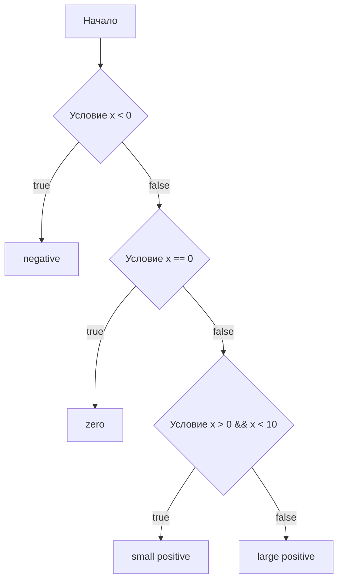

В Go конструкция `switch` может использоваться без явного условия, что превращает её в более читабельную альтернативу цепочке `if-else if-else`. В таком случае каждая ветка `case` выступает как логическое выражение, и выполнение попадет в первую из них, которая даст `true`. Это особенно удобно, когда требуется проверить несколько вариантов условий и выбрать только один из них, сохраняя код чистым и удобным для чтения.  

Пример:  

```go
x := 15
switch {
case x < 0:
    fmt.Println("negative")
case x == 0:
    fmt.Println("zero")
case x > 0 && x < 10:
    fmt.Println("small positive")
default:
    fmt.Println("large positive")
}
```  

Диаграмма логики:  



```old
// switch без условия полезен тем, что может использоваться для проверки нескольких условий
```