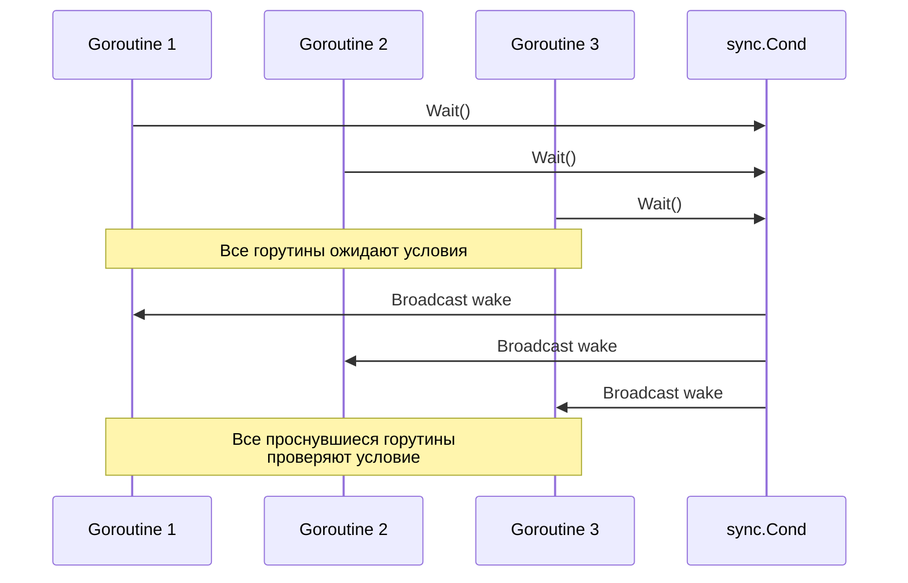

`sync.Cond` в Go — это примитив синхронизации, позволяющий координировать работу горутин через ожидание определённых условий. Его метод `Broadcast()` используется для широковещательного уведомления: он будит сразу всех горутины, которые находятся в состоянии ожидания на условной переменной, а не только одну (как это делает `Signal()`). Обычно это применяется, когда произошло глобальное изменение состояния, и каждая из ожидающих горутин должна проверить условие заново.  

Пример упрощённой схемы работы:  



```old
// sync.Cond тоже умеет в широковещательное оповещение всех слушателей - .Broadcast()
```