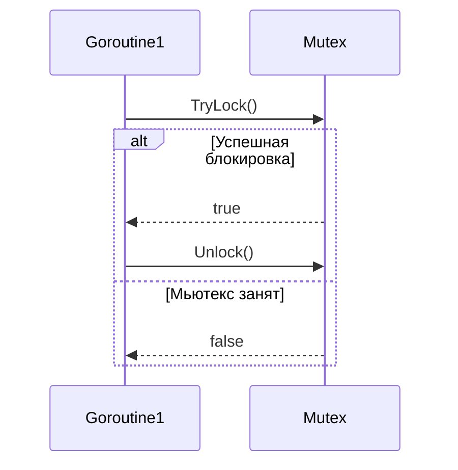

`sync.TryLock` появился в Go начиная с версии 1.18 как метод для типа `sync.Mutex`. В отличие от стандартного `Lock`, который блокирует выполнение до освобождения мьютекса, `TryLock` сразу возвращает либо `true`, если удалось захватить мьютекс, либо `false`, если мьютекс уже занят. Это удобно в ситуациях, когда программа должна продолжать выполнение без ожидания блокировки, например, при реализации неблокирующих структур данных или оптимизации конкурентных операций.  

Пример:  
```go
import (
	"fmt"
	"sync"
)

func main() {
	var mu sync.Mutex

	if mu.TryLock() {
		fmt.Println("Захватили мьютекс без блокировки")
		mu.Unlock()
	} else {
		fmt.Println("Мьютекс уже занят")
	}
}
```  

Диаграмма последовательности:  


```old
// sync.TryLock (начиная с 1.18)
```