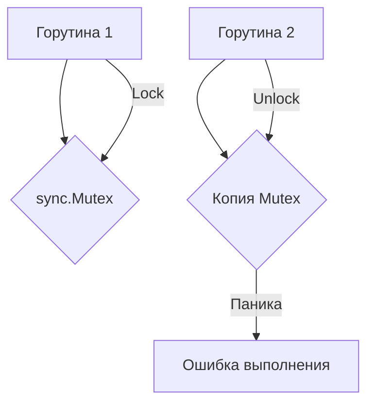

В Go существует правило, что объекты из пакета `sync`, такие как `Mutex`, `RWMutex`, `WaitGroup`, `Cond` и другие, не должны копироваться после первого использования. Это связано с тем, что внутри они содержат состояние работы (например, заблокированные горутины или внутренние счетчики), и при копировании может возникнуть рассинхронизация между оригиналом и копией. В результате копия может «сломать» блокировки или привести к панике и трудноуловимым багам.  

Например, копирование `sync.Mutex` после захвата блокировки создаёт две структуры, которые "думают", что управляют одним и тем же ресурсом. В итоге одна горутина может навсегда заблокироваться, а другая не будет знать об этом. Поэтому типичный совет — передавать такие объекты только по указателю.  

```go
package main

import (
	"fmt"
	"sync"
)

func main() {
	var mu sync.Mutex
	mu.Lock()

	// Нельзя делать так:
	copyMu := mu
	// copyMu.Unlock() // panic: sync: unlock of unlocked mutex

	mu.Unlock()
	fmt.Println("Всё работает только с исходным mutex")
}
```  

Mermaid-диаграмма:  



```old
// эти типы sync не должны копироваться: .Cond, .Map, .Mutex, .RWMutex, .Once, .Pool, .WaitGroup
```