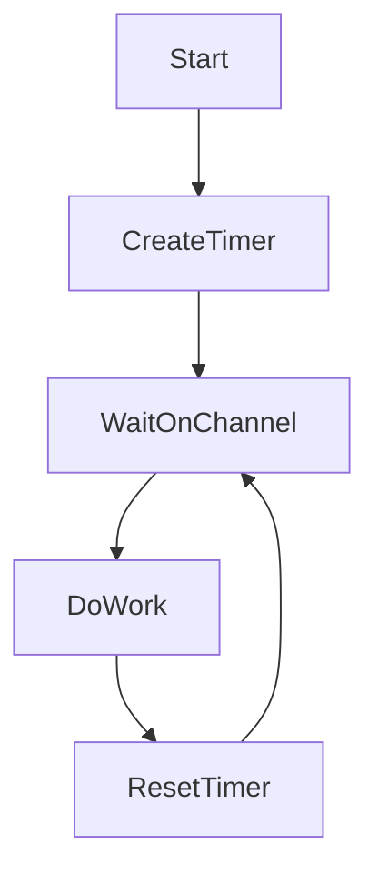

Когда в Go многократно вызывается `time.After`, каждый вызов создаёт новый таймер и горутину, которые удерживают память до тех пор, пока таймер не сработает. Если такие вызовы повторяются в цикле или при большом потоке запросов, это может привести к росту использования памяти и нагрузке на сборщик мусора.  

Для избежания утечек лучше использовать `time.NewTimer`, так как он позволяет переиспользовать один и тот же таймер: его можно останавливать и сбрасывать при необходимости. Такой подход предотвращает накопление большого количества объектов таймеров и уменьшает нагрузку на систему.  

```go
timer := time.NewTimer(time.Second)
defer timer.Stop()

for i := 0; i < 5; i++ {
    <-timer.C
    // работа
    timer.Reset(time.Second)
}
```



```old
// Когда вызов time.After повторяется (например, в цикле, в функции-потребителе Kafka или в обработчике HTTP), это может привести к пику в потреблении памяти. В таком случае используйте time.NewTimer.
```